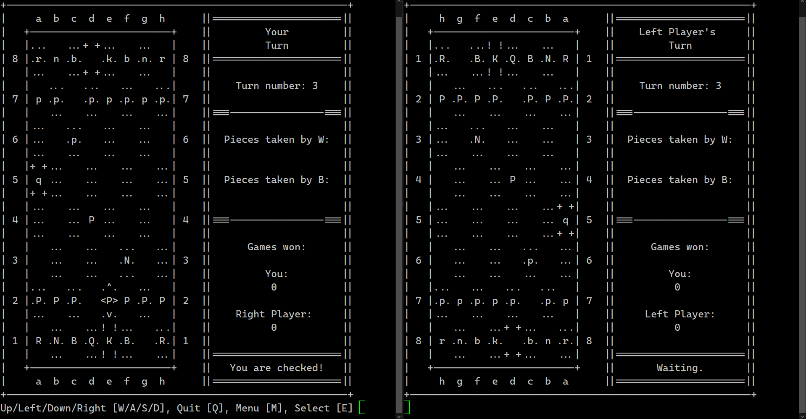

# ChessDB
A text-based multiplayer chess game written in the Kx System's (https://kx.com/) programming language Q

---

## How to Start a Game
First you will need a server to join; to start a server run `start_server.sh`, which can **optionally be passed a port number as an argument** for which it will host the server on, otherwise the server's port will default to the `DEFAULT_PORT` variable's value defined in `config.env` and the public and local IP address of the server will be logged upon it starting up

Clicking `run.sh` will start a client process for playing the game, to join a server you:
1) Select `PLAY` on the main menu
2) Enter and confirm a name you wish to call yourself in-game
3) Enter the IP and port of the server (Use local IP if on same network as the server and public otherwise) and select `Join`
4) Wait for another player to join the same server to start the game

#### Note:
To play a game hosted on another network port forwarding may be necessary on the host network (Search "How to port forward" for more information)

## Tips
- If `run.sh` and `start_server.sh` cannot start Q you may need to edit the Q_CMD override variable in `config.env` to a command that works on your machine
- To reset the server you can execute `reset[]` in its console
- When typing in the server IP address you can enter `localhost` or `.z.a` to easily set the IP to your local address
- You can move the game cursor out of bounds to wrap it around to the other side of the board

## Extras

### Screenshot of Gameplay:
